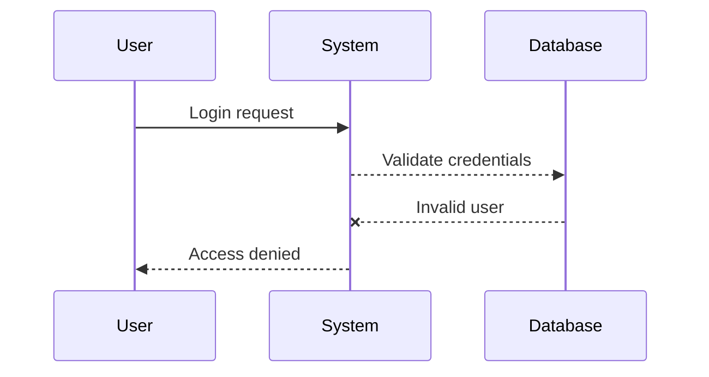
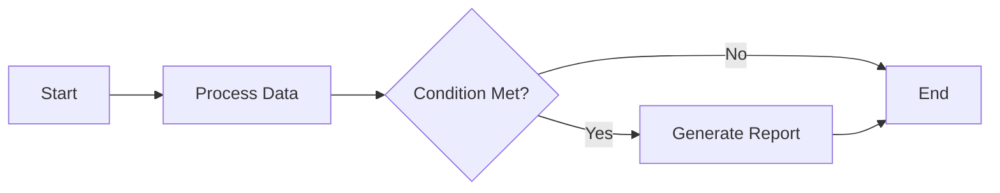

# Welcome to 'Markdown to file'


Rich Markdown editor and **markdown-to-PDF converter**. Below you can see the functionality of the Application.

## Basic Syntax

Our tool supports standard Markdown syntax, including headers, lists, links, images, emphasis, and code blocks, allowing you to create simple, well-structured documents.

## Images


## Extended Syntax

Additionally **MD2FILE** supports various Markdown flavors, including **CommonMark**, **GitHub Flavored Markdown (GFM)**, and **Markdown Extra**. This includes advanced features such as tables, task lists, footnotes, definition lists, and fenced code blocks, making it ideal for complex document formatting.

## Markdown extensions

**MD2FILE** enhances Markdown with additional extensions, bringing powerful features to your documents.

### LaTeX

Render complex mathematical expressions with [KaTeX](https://khan.github.io/KaTeX/).

For example, the _Beta function_ is defined as:

$$
B(x, y) = \int_0^1 t^{x-1}(1-t)^{y-1} dt
$$

> Learn more about LaTeX expressions [here](http://meta.math.stackexchange.com/questions/5020/mathjax-basic-tutorial-and-quick-reference).

### Diagramms and charts

Use [Mermaid](https://mermaidjs.github.io/) to render diagrams such as this sequence chart:



Or this flowchart:



### Code Syntax Highlighting

```js
console.log('foo')
```

```javascript
console.log('bar')
```

```html
<div id="editor"><span>baz</span></div>
```

```wrong
[1 2 3]
```

```clojure
[1 2 3]
```

### Emojis and Icons

Add emojis and icons to your documents with ease: 😊🎉✨

### Real-time Preview

**MD2FILE** offers a real-time preview feature, allowing you to see your rendered Markdown as you type.

### Export Options

Easily export your Markdown documents to **PDF** or **HTML** with a single click.
---

### more Emojis and List

1. 🗄️
2. 📊
3. 🚀
4. 📝
5. 📜
6. 🔄
7. 📦
8. 📈
9. 🔐
10. 🗝️
11. 🔒
12. 🤝
13. 👥
14. 👤
15. 🔑
16. 🚫
17. 🛠️
18. 🌐
19. 🎣
20. 📅
21. 📁
22. 🏷️
23. 🔗
24. ⚙️
25. 🧩
26. 🔧
27. 🧪
28. 🏃
29. 🗺️
30. 👉
31. ⚠️
32. ✅

👉 En total hay **32 emojis diferentes** en el documento.

---

### Title Emojis

n8n tables:

### 🗄️ `database_storage`
### 📊 `metrics_dashboard`  
### 🚀 `performance_boost`  
### 📝 `documentation_notes`  
### 📜 `workflow_history`  
### 🔄 `sync_process`  
### 📦 `package_manager`  
### 📈 `growth_stats`  
### 🔐 `data_encryption`  
### 🗝️ `secret_key`  
### 🔒 `secure_lock`  
### 🤝 `collaboration_tools`  
### 👥 `user_groups`  
### 👤 `single_user`  
### 🔑 `access_credentials`  
### 🚫 `restricted_access`  
### 🛠️ `dev_tools`  
### 🌐 `global_network`  
### 🎣 `event_hooks`  
### 📅 `scheduler`  
### 📁 `file_storage`  
### 🏷️ `tagging_system`  
### 🔗 `api_connections`  
### ⚙️ `system_config`  
### 🧩 `plugin_module`  
### 🔧 `service_connector`  
### 🧪 `testing_lab`  
### 🏃 `execution_flow`  
### 🗺️ `roadmap`  
### 👉 `pointer_action`  
### ⚠️ `warning_message`  
### ✅ `success_state` 

---


### 1.4 Verificar la creación del proyecto

Una vez completado, verás:
- ✅ **Database**: Estado "Healthy" 
- ✅ **API**: URLs generadas automáticamente
- ✅ **Authentication**: Configurado y listo
- 📊 **Dashboard**: Con métricas básicas disponibles

---

### 2.2 Crear el servicio web en Render

1. En el dashboard de Render, haz clic en "New +"
2. Selecciona "Web Service"
3. En la sección "You are deploying a Web Service", selecciona **"Existing image"**
4. En el campo de imagen Docker, ingresa: `docker.n8n.io/n8nio/n8n`
5. Configura el servicio:
   - **Name**: `n8n-app` (o tu nombre preferido)
   - **Project**: Haz clic en "Create new project" si quieres organizar mejor tus servicios
      - **Project name**: `n8n-automation-suite` (o el nombre que prefieras)
      - **Environment name**: `Production`
   - **Region**: `Oregon (US West)`
   - **Instance Type**: `Free 512 MB (RAM)`

   

