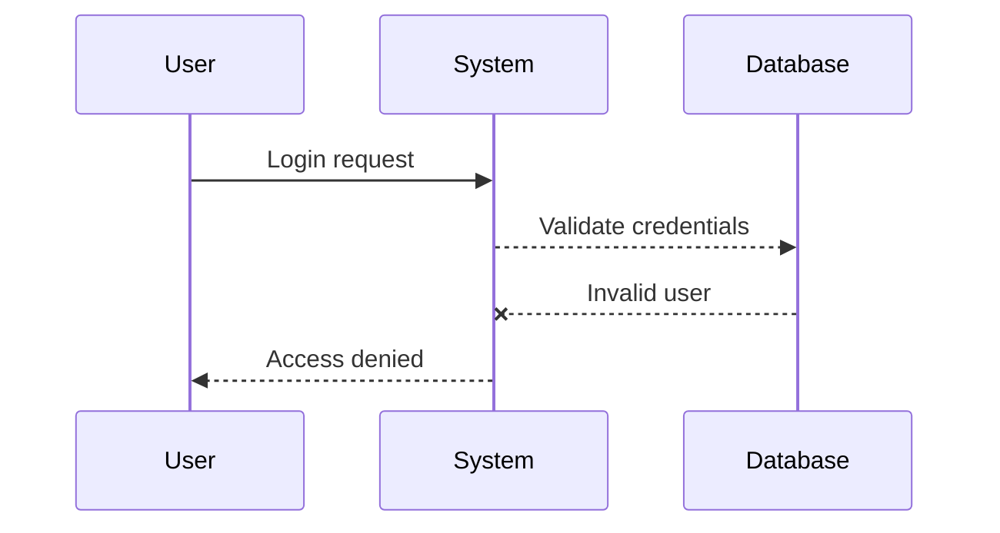
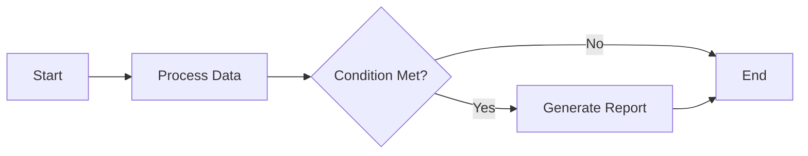

# Welcome to 'Markdown to file'


Rich Markdown editor and **markdown-to-PDF converter**. Below you can see the functionality of the Application.

## Basic Syntax

Our tool supports standard Markdown syntax, including headers, lists, links, images, emphasis, and code blocks, allowing you to create simple, well-structured documents.

## Images


## Extended Syntax

Additionally **MD2FILE** supports various Markdown flavors, including **CommonMark**, **GitHub Flavored Markdown (GFM)**, and **Markdown Extra**. This includes advanced features such as tables, task lists, footnotes, definition lists, and fenced code blocks, making it ideal for complex document formatting.

## Markdown extensions

**MD2FILE** enhances Markdown with additional extensions, bringing powerful features to your documents.

### LaTeX

Render complex mathematical expressions with [KaTeX](https://khan.github.io/KaTeX/).

For example, the _Beta function_ is defined as:

$$
B(x, y) = \int_0^1 t^{x-1}(1-t)^{y-1} dt
$$

> Learn more about LaTeX expressions [here](http://meta.math.stackexchange.com/questions/5020/mathjax-basic-tutorial-and-quick-reference).

### Diagramms and charts

Use [Mermaid](https://mermaidjs.github.io/) to render diagrams such as this sequence chart:



Or this flowchart:



### Code Syntax Highlighting

```js
console.log('foo')
```

```javascript
console.log('bar')
```

```html
<div id="editor"><span>baz</span></div>
```

```wrong
[1 2 3]
```

```clojure
[1 2 3]
```

### Emojis and Icons

Add emojis and icons to your documents with ease: 😊🎉✨

### Real-time Preview

**MD2FILE** offers a real-time preview feature, allowing you to see your rendered Markdown as you type.

### Export Options

Easily export your Markdown documents to **PDF** or **HTML** with a single click.
